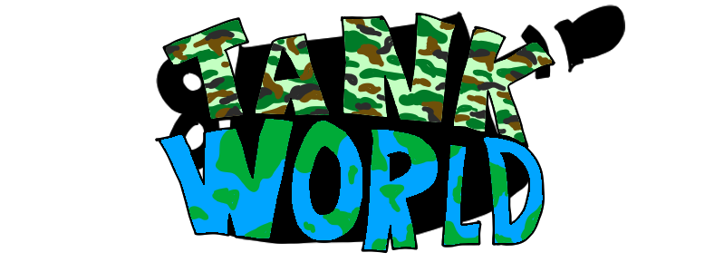
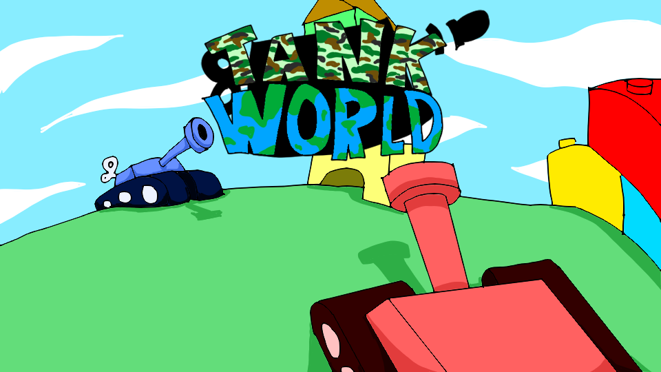
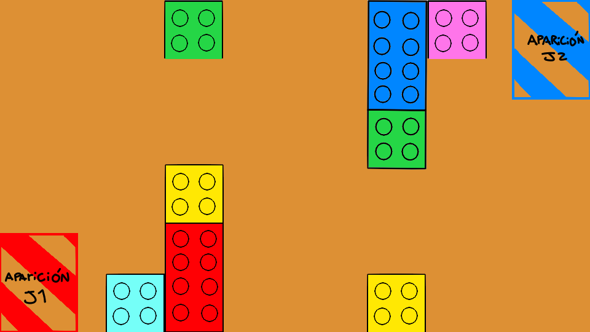
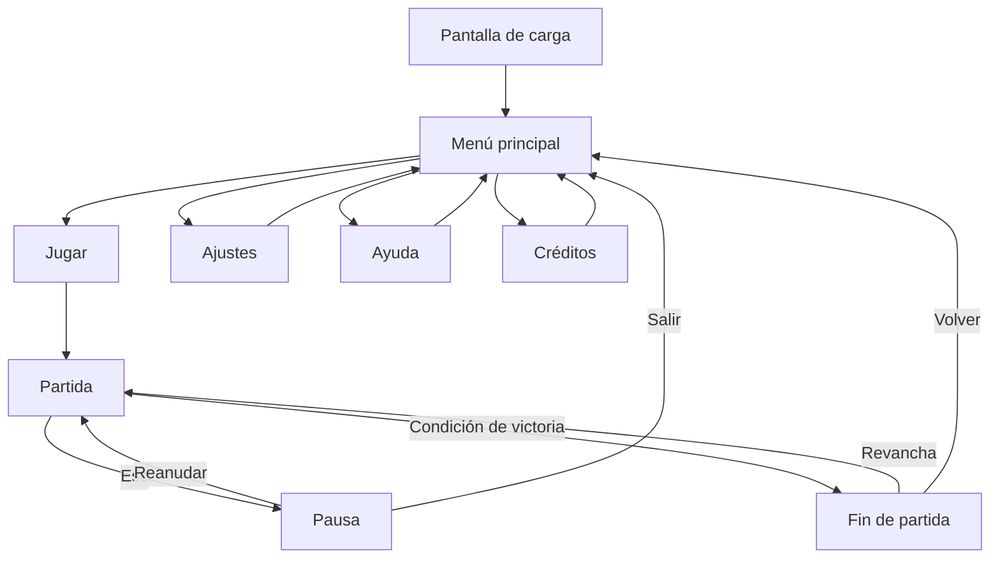

  

# Tank World

**Juegos en Red · Grado en Diseño y Desarrollo de Videojuegos · URJC · Curso 2026/27** 
**Grupo F**

## Descripción de la temática

Tank World es un juego party en 2D para dos jugadores en red en el que dos tanques de juguete tienen que enfrentarse en varios escenarios. Ambientado en una guerra de juguetes, los jugadores deben destruir los otros tanques para hacerse con la victoria.

## Equipo de desarrollo

| Nombre y apellidos | Correo URJC | GitHub |
| :--- | :--- | :--- |
| Víctor Bellón Casado | v.bellon.2024@alumnos.urjc.es | `@Victor-282006` |
| Daniel Jiménez Gómez | d.jimenezg.2024@alumnos.urjc.es | `@Dajigo333` |
| Iván Herrerín González | i.herrerin.2024@alumnos.urjc.es | `@i123van959` |

**Repositorio:** `https://[github.com/i123van959/Tank-World]`

**Licencia:** [Apache 2.0](LICENSE)

---

# Game Design Document (GDD)

## Índice

1. [Introducción](#1-introducción)
2. [Especificaciones básicas](#2-especificaciones-básicas)
3. [Jugabilidad](#3-jugabilidad)
4. [Narrativa](#4-narrativa)
5. [Imagen y diseño visual](#5-imagen-y-diseño-visual)
6. [Sonido](#6-sonido)
7. [Interfaz y diagrama de flujo](#7-interfaz-y-diagrama-de-flujo)
8. [Comunicación y marketing](#8-comunicación-y-marketing)
9. [Referencias](#9-referencias)

> **Nota para el alumnado:** este documento es una **plantilla de ejemplo**. Sustituid todos los textos `AAA`, `BBB`, `CCC`... y las imágenes de `img/` por vuestro contenido. Los bloques como este, que empiezan por *Rúbrica*, indican qué criterio de evaluación cubre cada apartado: **borradlos antes de entregar**. Límite orientativo: **3500 palabras**. Todo el documento debe estar en castellano (mezclar idiomas penaliza).

---

## 1. Introducción

### 1.1. Concepto del juego

Tank World es un juego party para dos jugadores en el que dos tanques se tienen que enfrentar para hacerse con la victoria. La idea principal es un enfrentamiento entre dos tanques de juguete, cada uno perteneciente a un equipo, que deben dispararse en distintos escenarios, para así acabar con el rival y conseguir la victoria.

### 1.2. Propuesta de valor

Nuestro juego destaca frente a otros debido a que vamos a incluir distintos mapas, cada uno con una ambientación única. Además vamos a incluir distintos potenciadores que harán de cada partida única. Y por último tendrá una estética atractiva que, aunque sea un juego de tanques que recuerde a la guerra, se distinguirá en todo momento que es todo un escenario montado por juguetes.

- Característica diferencial 1: Mapas variados.
- Característica diferencial 2: Potenciadores.
- Característica diferencial 3: Estética atractiva de juguetes.

*Figura 1. Imagen promocional del juego.*

---

## 2. Especificaciones básicas

> *Rúbrica — Documento / Especificaciones básicas:* género, público objetivo/edad y plataforma.

| Aspecto | Descripción |
| :--- | :--- |
| **Título** | Tank World |
| **Género** | Party game |
| **Número de jugadores** | 2 (en red, tiempo real) |
| **Público objetivo** | Jugadores casuales para todas las edades |
| **Clasificación PEGI** | PEGI 3 |
| **Plataforma** | Navegador web (PC), desarrollado con Phaser 3 |
| **Duración de una partida** | 3 minutos |
| **Representación** | 2D |
| **Licencia** | Apache 2.0 |

---

## 3. Jugabilidad

### 3.1. Objetivo del juego

> *Rúbrica — Jugabilidad / Objetivo del juego:* debe estar claramente definido.

El objetivo de cada jugador es destruir el tanque enemigo y evitar que el rival acabe contigo. La partida termina cuando uno de los dos tanques destruye el tanque rival. Gana el jugador que consiga eliminar al contrario dos veces.

### 3.2. Controles

> *Rúbrica — Jugabilidad / Controles.* Indicad teclado y ratón.

| Acción | Jugador 1 | Jugador 2 |
| :--- | :---: | :---: |
| Rotar a la izquierda | `A` | `←` |
| Rotar a la derecha | `D` | `→` |
| Moverse hacia delante | `W` | `↑` |
| Moverse hacia atrás | `S` | `↓` 
| Acción especial potenciador | `Espacio` | `Enter` |
| Apuntar / disparar | Ratón (clic izquierdo) | Ratón (clic izquierdo) |
| Pausa | `Esc` | `Esc` |

### 3.3. Mecánicas

> *Rúbrica — Jugabilidad / Mecánicas.*

#### 3.3.1. Mecánicas principales

- **Movimiento:** el tanque se puede mover hacia delante y hacia atrás dependiendo de a donde esté apuntando, para cambiar la dirección de movimiento se puede girar el tanque hacia la izquierda o hacia la derecha.
- **Disparo:** el tanque podrá disparar cada medio segundo en la dirección en la que este apuntando.
- **Potenciadores:** se podrán recoger potenciadores que aparecerán en el mapa, de los cuales, cada uno, tendrá una función distinta.

#### 3.3.2. Objetos y power-ups

| Objeto | Efecto | Duración | Aparición |
| :--- | :--- | :---: | :--- |
| Disparo explosivo | Disminuye el alcance del disparo, pero inflige daño en una pequeña área | 15 s | Aleatoria con tiempo indeterminado |
| Barrera | Mientras este activa el tanque no puede recibir daño | 10 s | Aleatoria con tiempo indeterminado |
| Disparo triple | Dispara tres balas, una hacia delante y dos ligeramente giradas hacia cada lado | 15 s | Aleatoria con tiempo indeterminado |
| Rebote | Las balas disparadas tienen la capacidad de rebotar una vez en las paredes | 15 s | Aleatoria con tiempo indeterminado |
| Más cadencia | Aumenta la cadencia de disparo pero disminuye el daño | 15 s | Aleatoria con tiempo indeterminado |

#### 3.3.3. Sistema de puntuación

Al acabar con el jugador contrario se conseguirá un punto. Gana el jugador que consiga dos puntos.

### 3.4. Físicas y dificultad

> *Rúbrica — Jugabilidad / Físicas:* físicas variadas con elementos de dificultad.

- **Colisiones:** entre proyectiles, obstáculos y jugadores.
- **Rebotes:** con el potenciador de rebote las balas rebotaran con los obstáculos.
- **Plataformas móviles o superficies especiales:** obstáculos con desplazamiento, obstáculos destructibles y obstáculos que impiden el paso pero no el disparo.
- **Progresión de la dificultad:** a medida que avanza la partida aparecen más potenciadores que dificultaran esquivar los disparos del rival.

### 3.5. Escenario

> *Rúbrica — Jugabilidad / Calidad del escenario.*

El escenario representa AAA AAA AAA. Se compone de AAA zonas:

1. **Zona AAA:** AAA AAA AAA.
2. **Zona BBB:** BBB BBB BBB.
3. **Zona CCC:** CCC CCC CCC.

*Figura 2. Mapa del escenario con zonas de aparición, plataformas y obstáculos.*

---

## 4. Narrativa

> *Rúbrica — Narrativa:* riqueza de la historia principal y de los personajes.

### 4.1. Historia

AAA AAA AAA AAA AAA AAA AAA AAA AAA AAA AAA AAA AAA AAA AAA AAA AAA AAA AAA AAA AAA AAA AAA AAA AAA AAA AAA AAA.

AAA AAA AAA AAA AAA AAA AAA AAA AAA AAA AAA AAA AAA AAA AAA AAA AAA AAA AAA AAA.

### 4.2. Personajes

#### AAA (Jugador 1)

- **Edad / origen:** AAA.
- **Personalidad:** AAA AAA AAA.
- **Motivación:** AAA AAA AAA.
- **Habilidad especial:** AAA AAA AAA.
- **Trasfondo:** AAA AAA AAA AAA AAA AAA AAA AAA AAA.

#### BBB (Jugador 2)

- **Edad / origen:** BBB.
- **Personalidad:** BBB BBB BBB.
- **Motivación:** BBB BBB BBB.
- **Habilidad especial:** BBB BBB BBB.
- **Trasfondo:** BBB BBB BBB BBB BBB BBB BBB BBB BBB.

#### CCC (enemigo / personaje no jugable)

CCC CCC CCC CCC CCC CCC CCC CCC.

---

## 5. Imagen y diseño visual

### 5.1. Logotipo

> *Rúbrica — Imagen / Logotipo.*

*Figura 3. Logotipo del juego. Tipografía: AAA. Concepto: AAA AAA AAA.*

### 5.2. Estilo visual

> *Rúbrica — Imagen / Estilo visual:* pixel art, cartoon, vectorial, etc.

El juego utiliza un estilo **AAA** (p. ej. *pixel art* de 32×32 píxeles) porque AAA AAA AAA.

### 5.3. Uso de colores

> *Rúbrica — Imagen / Descripción visual:* uso de colores.

*Figura 4. Paleta de colores del juego.*

- **Fondo (`#1B1F3B`):** AAA AAA AAA.
- **Jugador 1 (`#E94560`) / Jugador 2 (`#0F9BD7`):** colores complementarios para distinguir fácilmente a cada jugador.
- **Objetos (`#F5C518`):** AAA AAA AAA.

### 5.4. Aspectos técnicos: cámara y representación

> *Rúbrica — Imagen / Aspectos técnicos:* uso de cámara y 2D/3D.

- **Representación:** 2D, vista AAA (lateral / cenital / isométrica).
- **Cámara:** AAA (fija mostrando todo el escenario / sigue a ambos jugadores con *zoom* dinámico / pantalla dividida...).
- **Resolución base:** AAA × AAA píxeles.

### 5.5. Inspiración artística y cultural

> *Rúbrica — Imagen / Inspiración:* referentes artísticos y culturales y vínculo con otros trabajos.

*Figura 5. Moodboard con las referencias visuales.*

- **AAA** (videojuego, año): tomamos AAA AAA AAA [1].
- **BBB** (película / cómic / movimiento artístico): BBB BBB BBB [2].
- **CCC** (referencia cultural): CCC CCC CCC.

### 5.6. Bocetos de personajes y pantallas

> *Rúbrica — Imagen / Bocetos:* interfaz de menú, pantallas y personajes.

Los bocetos de los personajes se encuentran en el apartado [4.2](#42-personajes) y los de las pantallas en el apartado [7.1](#71-pantallas).

---

## 6. Sonido

> *Rúbrica — Sonido:* música y efectos.

### 6.1. Banda sonora

| Pista | Escena | Estilo / ambiente | Fuente / licencia |
| :--- | :--- | :--- | :--- |
| AAA | Menú principal | AAA (p. ej. *chiptune* relajado) | AAA (propia / CC-BY...) |
| BBB | Partida | BBB (p. ej. ritmo rápido, 140 BPM) | BBB |
| CCC | Victoria / derrota | CCC | CCC |

### 6.2. Efectos de sonido

| Efecto | Momento en que se reproduce |
| :--- | :--- |
| Salto | Al pulsar la tecla de salto |
| Golpe / impacto | AAA |
| Recoger objeto | AAA |
| Botones de la interfaz | Al pasar el ratón y al hacer clic |
| Cuenta atrás | AAA |

---

## 7. Interfaz y diagrama de flujo

### 7.1. Pantallas

**Menú principal**

*Figura 6. Menú principal: AAA AAA AAA.*

**Pantalla de juego (HUD)**

*Figura 7. Pantalla de juego: AAA AAA AAA.*

**Ajustes y fin de partida**

  
  

*Figura 8. Pantalla de ajustes (izquierda) y fin de partida (derecha).*

### 7.2. Diagrama de flujo

> *Rúbrica — Documento / Diagrama de flujo.* Podéis usar Mermaid (GitHub lo renderiza directamente) o una imagen exportada.

**Opción 1 — Mermaid** (se dibuja automáticamente en GitHub):

**Opción 2 — Imagen** exportada desde draw.io, Excalidraw, Figma...:

*Figura 9. Diagrama de flujo entre pantallas.*

---

## 8. Comunicación y marketing

> *Rúbrica — Comunicación / Marketing.*

- **Público y mensaje clave:** AAA AAA AAA.
- **Canales:** redes sociales (AAA, BBB), itch.io, Newgrounds, Game Jolt...
- **Calendario:** *teaser* en AAA, *devlog* semanal en AAA, lanzamiento en AAA.
- **Material:** tráiler, capturas, GIF de jugabilidad, *press kit*.
- **Eslogan:** «AAA AAA AAA».

---

## 9. Referencias

> *Rúbrica — Documento / Referencias.* Usad un formato consistente (p. ej. APA) y citadlas en el texto con [1], [2]...

[1] AAA, A. (Año). *Título de la obra*. Editorial / Estudio. URL

[2] BBB, B. (Año). *Título del artículo*. Revista, volumen(número), páginas. https://doi.org/AAA

[3] Schell, J. (2019). *The Art of Game Design: A Book of Lenses* (3.ª ed.). CRC Press.

[4] Phaser Studio. (s. f.). *Phaser 3 Documentation*. https://docs.phaser.io

[5] Recursos de terceros utilizados (sprites, música, fuentes): AAA — autor — licencia — URL.
